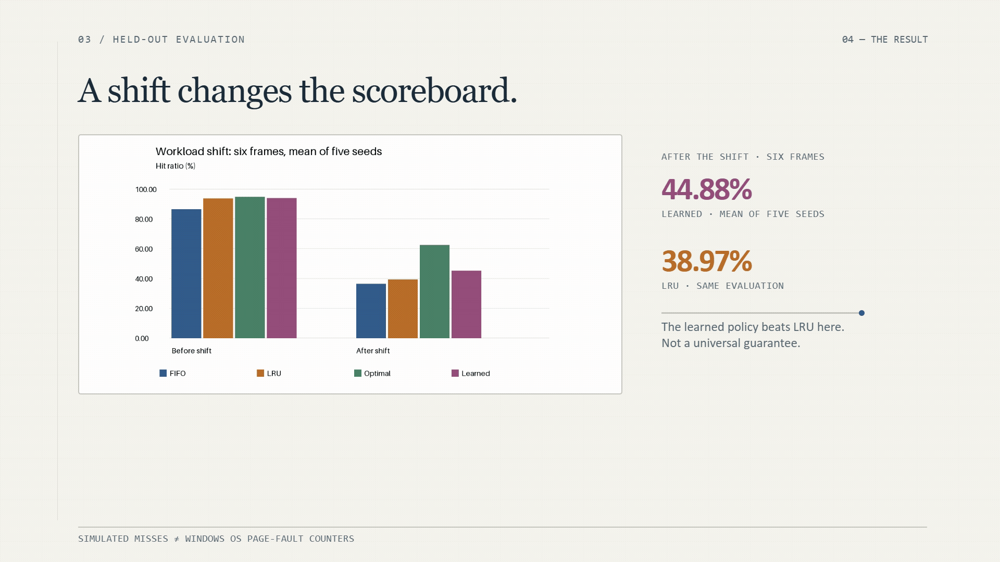

# Page policies and resource pressure



An original CSE307 Track 1 experiment: FIFO, LRU, Optimal and a small trained
non-reuse classifier, followed by independent Windows memory/CPU measurements.

## Run

Python 3.13 was used for the saved run. In PowerShell, from this directory:

```powershell
python -m venv .venv
.\.venv\Scripts\python.exe -m pip install -r requirements.txt
.\.venv\Scripts\python.exe main.py --check
.\.venv\Scripts\python.exe main.py
```

Activation is optional. Full execution requires Windows and at least two allowed
logical CPUs. No administrator access should normally be needed; an unsuccessful
working-set API call stops the experiment instead of silently removing the cap.
Other platforms can run `python main.py --simulation-only`, which writes to
`results/simulation_only/` and keeps the full experiment's provenance intact.

## What the code does

- `simulation.py`: seeded workload, all four eviction policies, independent checks.
- `windows_experiment.py`: fresh bounded child processes, memory caps, CPU affinity.
- `make_reports.py`: charts and 3-page/4-page PDF drafts generated from CSV data.
- `main.py`: checks, runs both experiments, saves metadata and builds reports.

The simulator uses 24 page IDs and 2400 references. At reference 1200, a
four-page loop with 8% noise becomes 65% random access and 35% moving bursts.
Five evaluation seeds and three frame counts give 60 policy runs. Cache state
is preserved at the shift. `results/summary.txt` contains the measured summary.

The depth-4 tree learns whether a resident page will **not** appear within the
next 12 references. Recency and frequency in the last 32 references are the
only features. Separate training seeds use LRU occupancy for candidate sampling;
evaluation uses no future-derived feature or label. The classifier is fixed,
not retrained online. Optimal alone uses future knowledge during evaluation.
The trained rules are saved as readable `results/tree.txt`.

The Windows memory test updates 48 MiB using shuffled page-spaced accesses,
under 24/96 MiB hard working-set caps. The CPU test always uses two workers,
restricting their combined scheduling to one/two logical CPUs. Three repetitions
use shuffled condition order. Caps affect our child processes only.

## Results and reports

`results/` contains:

- `simulation.csv`: per-seed/frame/policy/phase faults and hit ratios.
- `evaluation_trace.csv`: illustrative seed-11 trace, with explicit shift labels.
- `windows.csv`: 100-reference simulator fault-rate bins for seed 11, six frames.
- `windows_resources.csv`: all real resource observations, times and checksums.
- `metadata.json`: environment, dependency versions and experiment parameters.
- Three PNG charts and `summary.txt`.
- `algorithm_report.pdf` (3 pages) and editable `.md`: algorithm-track report.
- `windows_report.pdf` (4 pages) and editable `.md`: resource-experiment report.

To regenerate reports from saved data without rerunning: `python make_reports.py`.
Same simulation inputs produce the same CSV; real timings vary with the machine.
`--simulation-only` generates algorithm artifacts in its separate output folder.

## Scope and interpretation

Simulation misses are not measured Windows page faults. Windows counters combine
soft and hard faults; these measurements do not establish disk swapping.
Working-set caps control residency, not VM RAM or committed memory. Affinity is
not a virtual-CPU configuration. We use Windows as the agreed substitute for
Ubuntu; results do not claim identical Ubuntu/VMware behavior.

The resource experiment uses Windows process controls as a local substitute for
Ubuntu/VMware settings; it does not claim identical behavior. Original course
PDFs remain outside this repository.

## AI disclosure and authorship

AI assistance supported the original implementation, report drafting, and local
experiment execution. The author reviewed the code, saved results, and report
analysis. Windows timing observations describe this machine and can vary across
runs and systems.

## Sources

1. Supplied `CSE307_TermPaper_Brief(Part-B).pdf`, Track 1.
2. [OSTEP: Beyond Physical Memory, Policies](https://pages.cs.wisc.edu/~remzi/OSTEP/vm-beyondphys-policy.pdf).
3. [scikit-learn decision trees](https://scikit-learn.org/stable/modules/tree.html).
4. [Microsoft: working sets](https://learn.microsoft.com/en-us/windows/win32/memory/working-set).
5. [Microsoft: SetProcessWorkingSetSizeEx](https://learn.microsoft.com/en-us/windows/win32/api/memoryapi/nf-memoryapi-setprocessworkingsetsizeex).
6. [psutil documentation](https://psutil.readthedocs.io/).
