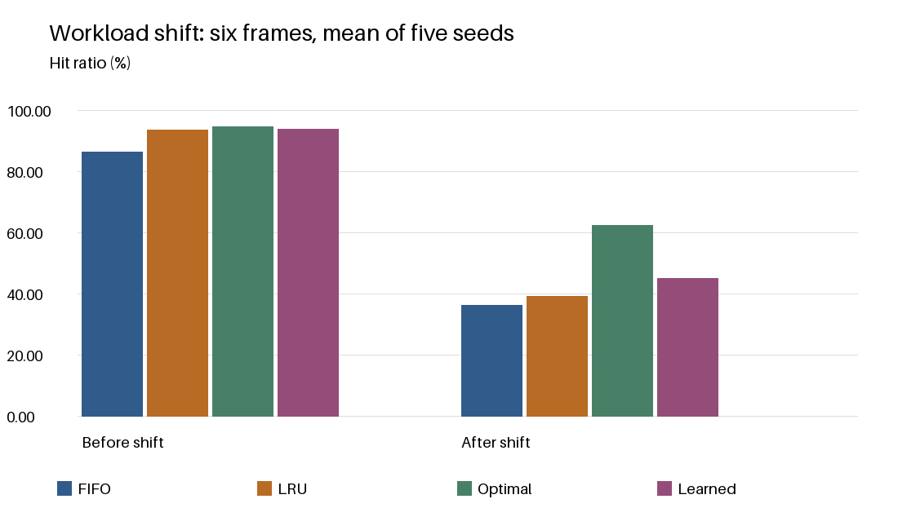
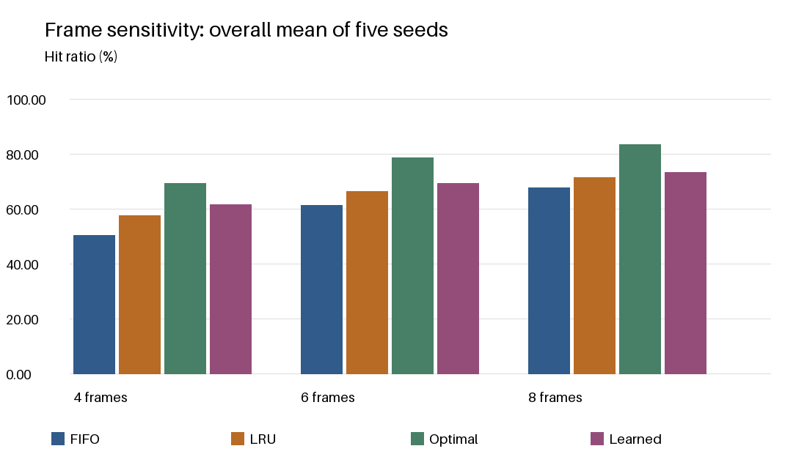

# Page Replacement Under a Workload Shift

## Problem and hypothesis

A limited page cache must choose a victim on a miss. We compare FIFO, LRU, offline Optimal, and a learned reuse classifier under an abrupt access-pattern shift [1,2]. The hypothesis is that localized accesses are easier to cache than random/bursty accesses; learned prediction may or may not improve on LRU.

## Implementation

FIFO removes the earliest insertion, without refreshing on a hit. LRU removes the least recently referenced page. Optimal removes the page used farthest in the future, or never again. All policies begin empty and retain cache contents at the phase boundary. The independent correctness check includes a textbook string, Belady's FIFO anomaly, and 729 traces checked against exhaustive minimum-fault search.

## Learned component

A depth-4 decision tree with minimum leaf size 40 is trained on 19002 candidate samples [3]. Features are references since last use and count in the previous 32 references. The binary label is no reuse in the next 12 references, collected from LRU-managed training caches. At a miss the highest predicted non-reuse probability is evicted; ties use oldest access then smaller page ID. The tree is inspectable in tree.txt. This predicts short-horizon non-reuse, not exact Belady victims.

## Experimental setup

Four independent training seeds (101-104) and five held-out evaluation seeds (11,22,33,44,55) are used. Each trace has 2400 references to 24 page IDs. Before index 1200, 92% of requests follow a four-page cyclic loop and the rest are random. Afterwards, 65% are uniform random and 35% use a moving three-page burst set. We evaluate 4, 6, and 8 frames. Training traces never contain evaluation references. Future information is used only for training labels and the offline Optimal baseline.

## Results at six frames

| Policy | Before faults | After faults | Before hit % | After hit % |
| --- | --- | --- | --- | --- |
| FIFO | 163.4 | 767.2 | 86.38 | 36.07 |
| LRU | 78.8 | 732.4 | 93.43 | 38.97 |
| Optimal | 66.4 | 451.6 | 94.47 | 62.37 |
| Learned | 75.6 | 661.4 | 93.70 | 44.88 |

## Hit ratios before and after the shift

## Observed change

With six frames, LRU had the greatest hit-ratio drop (54.47 percentage points). The learned policy changed from 93.70% to 44.88%. These are measured outcomes, not a guarantee of learned-policy superiority.

## Measurement

Each phase has 1200 references. Hit ratio equals 1 minus faults divided by references. The table reports means across five seeds; simulation.csv retains every seed and frame count. windows.csv stores 100-reference fault-rate bins for one illustrative trace. Counts are simulator misses, not Windows OS page-fault counters.

## Analysis

The learned policy's overall hit ratio was +3.09 percentage points relative to LRU at six frames. The first phase concentrates requests on four pages, so retaining recent hot pages is useful. After the shift, a larger effective working set and less predictable reuse weaken recency and frequency as predictors. Optimal still has privileged future information. A large percentage-point drop can reflect a particularly strong first phase, rather than the worst absolute second-phase performance. The tree is fixed after training: its inputs change online, but its rules do not.

## Frame-count sensitivity

## Limitations and conclusion

The workload is synthetic, the classifier sees only two historical features, and training candidates come from LRU rather than the learned policy's own occupancy. This state-distribution mismatch and the fixed prediction horizon can limit generalization. We do not model dirty writes, disk latency or OS overhead. Five seeds describe this generator, not all workloads. The defensible conclusion is that workload shifts affect every policy; future-aware Optimal supplies a lower bound and learned eviction must be evaluated rather than presumed better.

## References and disclosure

[1] CSE307 Term Paper Brief (Part-B), Track 1, supplied course document.
[2] Arpaci-Dusseau & Arpaci-Dusseau, Operating Systems: Three Easy Pieces, chapter 22: Beyond Physical Memory: Policies. https://pages.cs.wisc.edu/~remzi/OSTEP/
[3] scikit-learn, Decision Trees. https://scikit-learn.org/stable/modules/tree.html
AI assistance supported implementation, report drafting and local experiment execution. The author reviewed the code, saved results, and report analysis.
