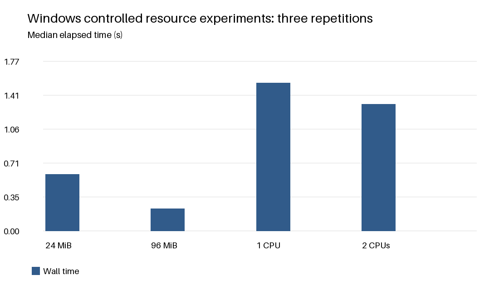

# Windows Memory and CPU Resource Experiments

## Research question

How does the same bounded workload behave when available residency or CPU scheduling resources change? This Windows experiment complements the simulated page-replacement study with real process measurements. No classifier or trained model is used in these resource workloads.

## Windows adaptation

The resource experiment uses Windows processes rather than Ubuntu guests. A hard maximum working-set limit controls resident pageable memory [4,5]; it does not cap committed virtual memory or emulate a VM RAM allocation. CPU affinity restricts workers to one or two allowed logical CPUs [6]; it is not a VMware virtual-CPU configuration. These substitutions permit controlled local measurements but do not establish Ubuntu/VMware behavior.

## Environment

Python 3.13.1; Windows; AMD64 Family 25 Model 116 Stepping 1, AuthenticAMD; 16 logical CPUs; 15557 MiB installed RAM. The first two allowed logical CPU IDs are [0, 1]. Exact dependency versions and run time are in metadata.json.

## OS background

Resident working-set pages can be accessed without a residency fault. A fault may be soft, resolved from RAM, or hard, requiring backing-store I/O [4]. A restricted process can fault repeatedly even when the whole machine has ample free RAM. Thus total process page faults alone are not proof of disk swapping or system-wide thrashing.

## Memory workload

A fresh child sets a 24 MiB or 96 MiB maximum working set using SetProcessWorkingSetSizeEx with HARDWS_MAX_ENABLE and HARDWS_MIN_DISABLE. The API return is checked. It allocates 48 MiB, constructs a fixed shuffled list of 4096-byte-spaced offsets, and updates one byte at each offset for eight passes. Both conditions use identical accesses and one CPU. Allocation faults occur before the counter baseline and are excluded; setup and allocation time remain in parent wall time.

## CPU workload

Each condition launches two independent Python processes. Each performs 12000 SHA-256 hashes of a 64 KiB buffer. Both workers are restricted to the same one CPU or same two CPUs. The number of workers and total work stay constant, so elapsed-time differences reflect resource availability plus scheduling and startup effects. Logical CPUs may share a physical core; two logical CPUs do not necessarily double throughput.

## Protocol and metrics

Three repetitions per condition run in a deterministic shuffled order to reduce simple order bias. Each condition uses new processes. Parent wall time includes startup; work_seconds records the slower child's measured loop duration. Child CPU times are summed. Page-fault deltas use psutil's Windows counter; RSS is sampled after each pass and reported as the maximum sample per child. RSS is not a continuously observed peak. Subprocess timeouts and nonzero exits fail the run.

## Reproduction

From the project folder run python main.py. The run checks the simulator, trains and evaluates it, executes 12 resource conditions, and regenerates tables, charts and reports. Raw observations are saved before report generation. Repeated Windows timings are expected to vary; seeded simulation CSV values should repeat.

## Measured resource results

| Condition | Median wall s | Range s | Median faults | Sampled RSS MiB |
| --- | --- | --- | --- | --- |
| 24 MiB | 0.588 | 0.561-0.641 | 85101 | 24.00 |
| 96 MiB | 0.227 | 0.222-0.240 | 1 | 70.20 |
| 1 logical CPU(s) | 1.537 | 1.530-1.573 | 6 | 21.69 |
| 2 logical CPU(s) | 1.319 | 1.135-1.358 | 6 | 21.70 |

## Elapsed-time comparison

## Memory and CPU comparisons

Median end-to-end memory runtime was 2.60 times as high at 24 MiB versus 96 MiB. CPU end-to-end speedup (one-CPU time / two-CPU time) was 1.17. The table includes ranges because only three repetitions are available. These ratios describe this run and include process startup, not just steady-state throughput.

## Integrity of observations

windows_resources.csv contains all 12 observations, checksums and separate child work times. Identical memory checksums should occur in every condition, showing that the same number of updates completed. Total Windows faults include soft and hard faults. No disk-I/O trace was collected, so the measurements cannot isolate hard-fault costs.

## Connecting simulation and measurement

With six frames, LRU had the greatest hit-ratio drop (54.47 percentage points). The learned policy changed from 93.70% to 44.88%. These are measured outcomes, not a guarantee of learned-policy superiority. The simulation explicitly selects victims, whereas the Windows kernel owns replacement in the resource experiment. We did not install FIFO, LRU or the learned policy in Windows. The experiments share the concept of limited residency, but their page-fault counts have different definitions and cannot be directly compared.

## Interpretation and limitations

A tight residency cap is expected to make revisiting the 48 MiB allocation incur more faults. Removed pages can remain in physical RAM outside the process working set, so increased faults may largely be soft faults [4]. CPU results can depend on physical-core placement, thermal conditions, other applications and scheduler overhead. The workload is deliberately small and synthetic. Working-set samples and three repeats do not justify universal performance claims. Controlled VM experiments would be needed to extend the conclusion to Ubuntu or VMware.

## Conclusion

This project supplies two complementary pieces of evidence: deterministic policy-level behavior under a deliberate trace shift, and real Windows process measurements under bounded resource restrictions. The saved raw observations support local comparisons and make negative or mixed learned-policy results visible. Resource experiments remain independent of training.

## References and disclosure

[1] CSE307 Term Paper Brief (Part-B), Track 1, supplied course document.
[2] Arpaci-Dusseau & Arpaci-Dusseau, Operating Systems: Three Easy Pieces, chapter 22: Beyond Physical Memory: Policies. https://pages.cs.wisc.edu/~remzi/OSTEP/
[3] scikit-learn, Decision Trees. https://scikit-learn.org/stable/modules/tree.html
[4] Microsoft, Working Set. https://learn.microsoft.com/en-us/windows/win32/memory/working-set
[5] Microsoft, SetProcessWorkingSetSizeEx. https://learn.microsoft.com/en-us/windows/win32/api/memoryapi/nf-memoryapi-setprocessworkingsetsizeex
[6] psutil documentation. https://psutil.readthedocs.io/
All web references accessed during project generation on 2026-10-04.
AI assistance supported implementation, report drafting and local experiment execution. The author reviewed the code, saved results, and report analysis. Windows was used as the local substitute for Ubuntu/VMware resource settings; the report explains the differences and limits.
